# **Word Salad**
Word Salad a fun and colourful grammar themed quiz aimed at kids who need to practice their understanding of the basic word-classes. The quiz tests the user’s knowledge and helps them learn the difference between nouns, adjectives, verbs and adverbs. It also demonstrates how these are used to form sentences. The quiz is aimed at primary/ elementary children, no more than 11 or twelve years of age.

At the end of the quiz, the user is congratulated on completing, regardless on their score, and is presented with a “silly word-salad sentence” that is generated using the words they have been working with. They are prompted to write some silly sentences of their own using the same key words and are encouraged to play the quiz again. Each time the quiz is played, a different silly sentence is generated.

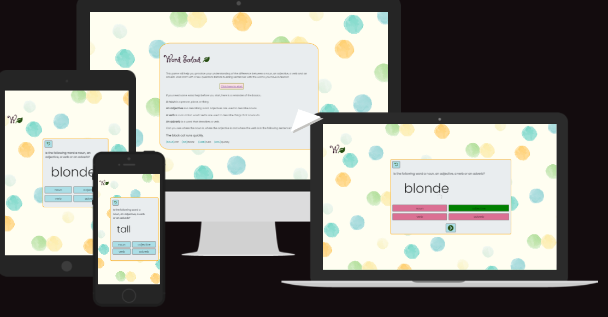

## **Project Scope, Design & User Experience**

In terms of the scope of the project, I decided to focus on just four word-classes. Not only did this mean there were only four possible answers repeated for each question, making it easy to style the answer buttons for just those particular words, but it meant that - given the timeline for project submission (I had two weeks) - I could make sure that these four concepts were fully explored in the quiz, giving the user plenty of practice to consolidate their knowledge. This seemed a far better option in terms of creating a fit-for-purpose real-world functioning educational tool. Otherwise, I might have been more ambitious in my scope but ended up with a quiz frustrating for the child user. Children do need a sense of positive achievement and progress in their educational activities, or else they can become discouraged after having a negative experience and subsequently decide they just don’t like “that awful, boring” subject anymore (in this case, grammar, which is a dry enough subject area to start with).

Because grammar can be a dull subject, I gave the quiz a colourful background with a colour-scheme based on the primary colours blue, green, yellow and red. This felt suitable as it reflected the four possible answers/ word-classes of noun, verb, adverb and adjective, and also made the screen look playful and fun.  

 

Desktop version of homepage.  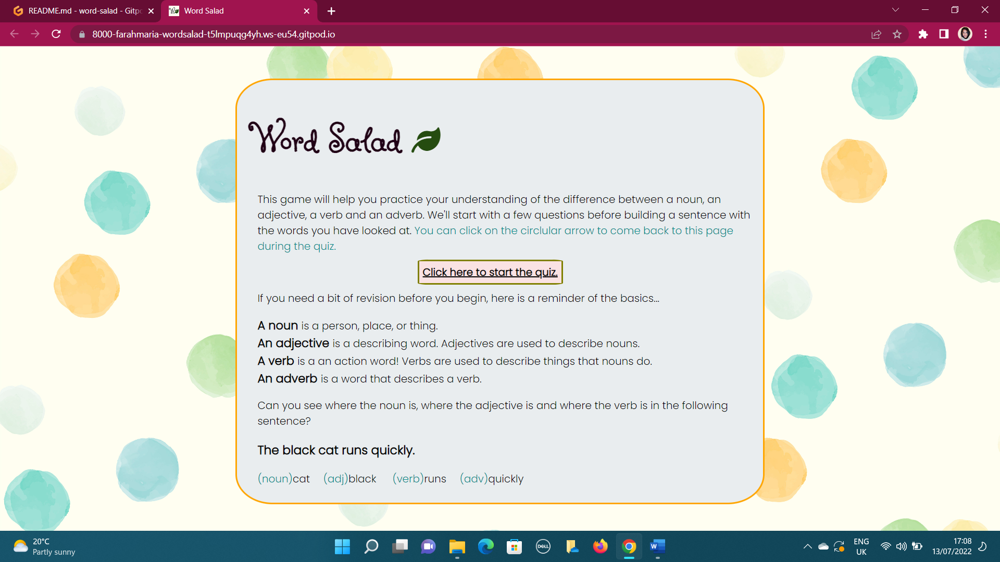

 

I did initially think of making each answer button a different primary colour, but I decided this was too ‘busy’/ potentially confusing in appearance for a young user, given that the buttons also change colour after an answer is clicked-on to either green or red/pink (to show which solution is correct and which solutions are not).

The red, technically, is substituted for a dark pink. I recall from my teacher training years ago that kids have started to associate red with ‘negative’/ ‘bad’/ ‘a fail’ in learning activities, which isn’t so encouraging for much younger kids. The pink is softer than a glaring red, while the answer grid colours still clearly indicate which answer is correct. Red is also a very loud colour as a background for text, so it didn’t feel like a great choice for a button with an answer typed on it, especially as younger children are still gaining their confidence in reading.

Clear navigation, consistency in design and accessibility were important in the creation of the quiz. The homepage defines the word-classes with an example sentence, and a nice big button in the middle of the text-area can be pressed to start the quiz. It actually says ‘click here to start the quiz’ on it, and the button has a hover effect making it easier for a younger user with less practiced coordination to know when they have the pointer in the right place before ‘clicking’. The hover effect is quite clear (a change in border colour and an underline) to make the navigation journey clear for children.

I wanted a simple structure to the quiz right from the beginning, when I hand-drew my wireframes...

 

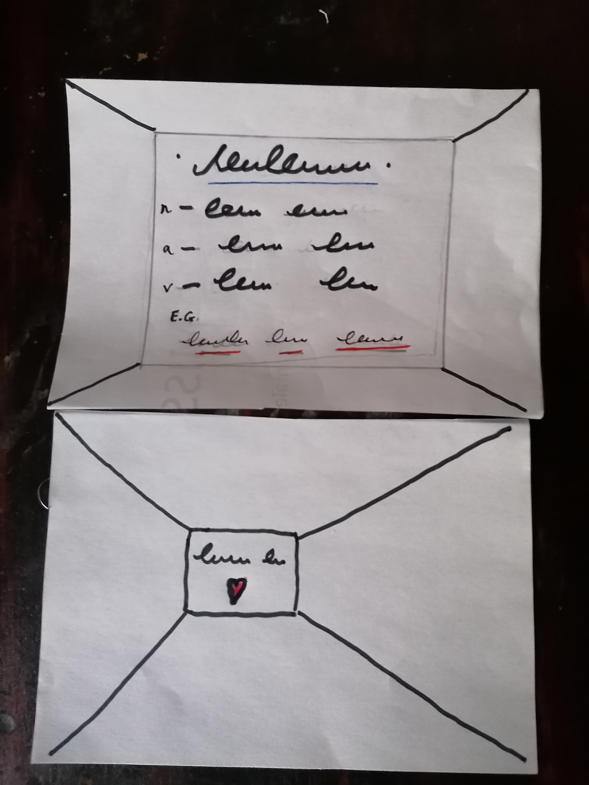

 

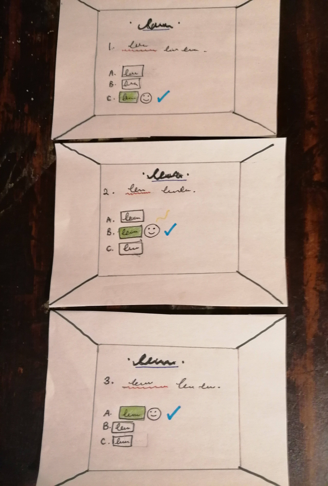
     
 

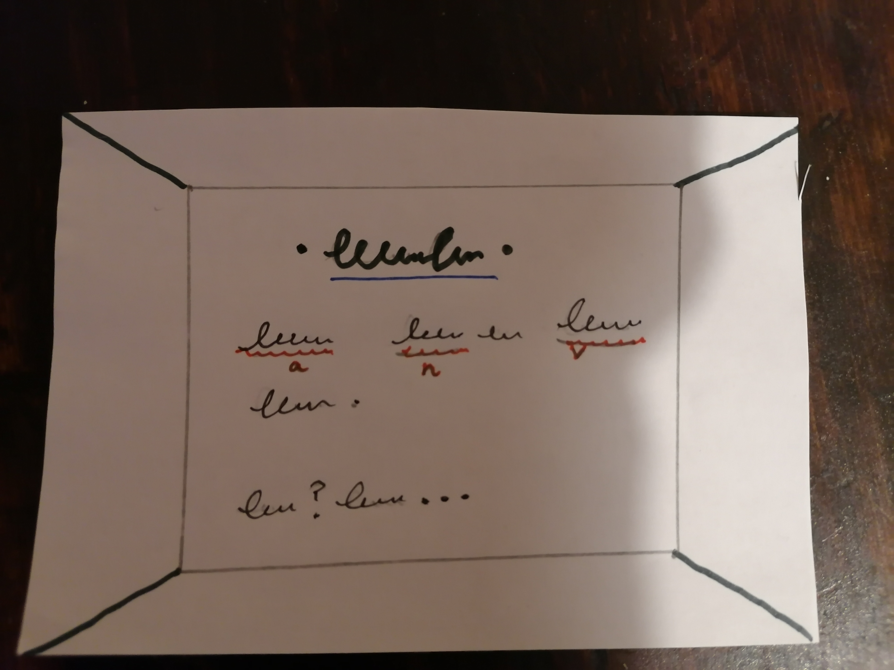

      

Image one  is the homepage that explains the word-classes and the second wirefram on it represents the 'ready?' page, which builds up a bit of fun tension before the quiz starts and adds some extra interactivity and involvement, as the user has a button to press to 'agree'. The actual 'ready' page is shown below:

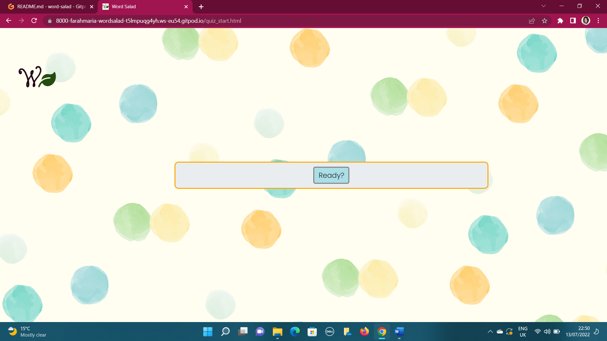

      

Images two of the wireframing shows the multiple-choice questions and answers section, and image three of the wireframing process shows the final page with the word-salad sentence generated from the words the user has been working with.

A few minor aspects of design changed after the wireframing process, mainly to make the navigation both clearer and more interesting. The final wireframe ended up as a brightly coloured modal that pops up and congratulates the user on completing the quiz, as well as generating the word-salad sentence. I'll discuss this further under 'features'.

When it came to the fonts, I used "Butterfly Kids" from Google Fonts for the quiz heading and logo, as it's playful and silly, which suits the final word-salad concept of making silly sentences. I used 'Poppins' from the same source for regular text on the site, which was a pairing that fitted visually - both fonts are from the 'butterfly kids' font-family - with the advantage of Poppins being both clear and bold enough for younger readers to be able to decipher with relative ease. 

## Design Responsivity in Relation to User Experience, Scope & Strategy

Design responsivity for different devices is essential for positive user experiences. According to a recent article  by the online magazine Design Rush (15 Screen Resolutions to Design For | DesignRush), 90% of website visitors bounce due to poor design, and I've seen first-hand how often parents hand their children an iphone to play games with to keep them quiet and entertained in public. I therefore took a mobile-first approach when designing and coding the project. The set-up of boxes and containers for questions and answers made it relatively easy to make the pages into a responsive grid. I did make sure the quiz looks nice on larger screens, too, as I'd like the quiz to be used educationally in homes and schools, where a desktop computer or tablet is more likely to be used for learning activities. 

I made sure there was strong contrast between content and the background - the pastel-coloured spots in the background are distinctive but not too loud or distracting. I aimed to make the quiz look clean-cut, simple and fun. 

The logo from the quiz pages is in the same style as the 'Word-Salad' title on the homepage, with the same icon of a leaf. The concept is clear - a 'W' for word and a green leaf for 'salad'. I used this as the favicon, too, so there is consistency in the design across the different sections of the quiz.

The navigation buttons have icons on them and are repeated on each page of the quiz, allowing the user to go back to the homepage or go to the next question. These icons were taken from Font Awesome and can be seen below.

The 'well done' button and modal at the end of the quiz give the user a clear and unambiguous sign that they have completed the quiz, but can play again if they want to. There is a button to restart the quiz.

The navigation journey is clear throughout, and the design consistent, with the same background image being used and the same coloured boxes and borders. The background image is suggestive of children's creativity and work, as it shows watercolour painted dots that could have been made by young person. 

Given more time, I would have written more media queries to make the quiz more attractive on all screen sizes. However, with the emphasis in this project being less on the media queries and more on the vanilla JavaScript code, I mainly made sure that the quiz is playable, pleasant, functioning and clear on different screen sizes, rather than really trying to make it look fantastic on any screen. If I got to extend the scope of the project with an extra few days to work on responsivity, I would have.

## Existing Features

It is hard to completely separate the topics that need attention in this document, so there is some overlap, but I will avoid repeating descriptions.

-_Homepage_

The homepage states the purpose and nature of the quiz in the first paragraph, and also describes the final outcome, which is a silly sentence and a prompt for the user to create their own silly sentences. There is a central link (styled as a button) that takes the user straight to the quiz if they do not need to be reminded of the four word-classes. 

The child-oriented background image is introduced here, and is used throughout the game. 

There is a hover/ pointer effect on the 'start quiz' button.

-_ 'Ready?' Page_

This was added purely for extra interactivity. The whole focus of the page is the 'Ready?' button, which takes the user to the quiz questions. 

This page introduces the logo, which stays in the top left-hand centre of all the quiz pages. The same image (shown below) is also used as the favicon.

 

      

I am aware that the image is too small to be distinctive as a favicon, and I would work on having a clearer one if I had the opportinity to work on the project again.

-_The Quiz_-

Each frame of the quiz has the same lead question and four possible answers, but each has a different keyword. The user chooses whether s/he thinks the word is a noun, adjective, verb or adverb. After the answer button is clicked by the user, the correct answer button turns green and the others turn pink, giving immediate feedback to the user.

As the user will likely be a child, immediate feedback and reinforcement seemed important (children are less patient). There is the option to click an arrow button to go the next question or click the circular arrow button to go back to the homepage to revise the definitions before trying again. 

 

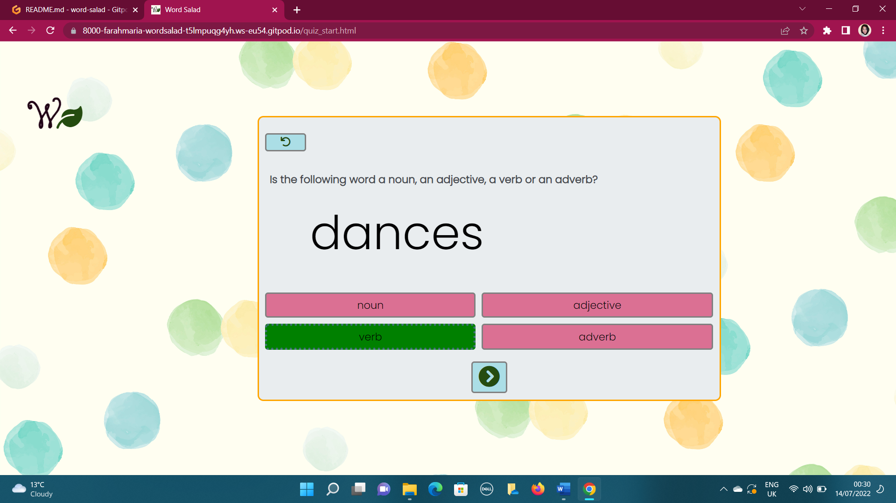

      

There is a hover effect on all of the buttons, and the curser turns into a pointer, helping children to navigate the mouse. The image above shows the four answer buttons in 'solution' mode, with the correct answer in green.

There are 20 questions, shuffled each time, so they appear in a different order each time the game is played.

-_Modal Text-Box on Completion_-

When the 20 questions are answered, an orange modal text-box pops up, as shown below: 

 

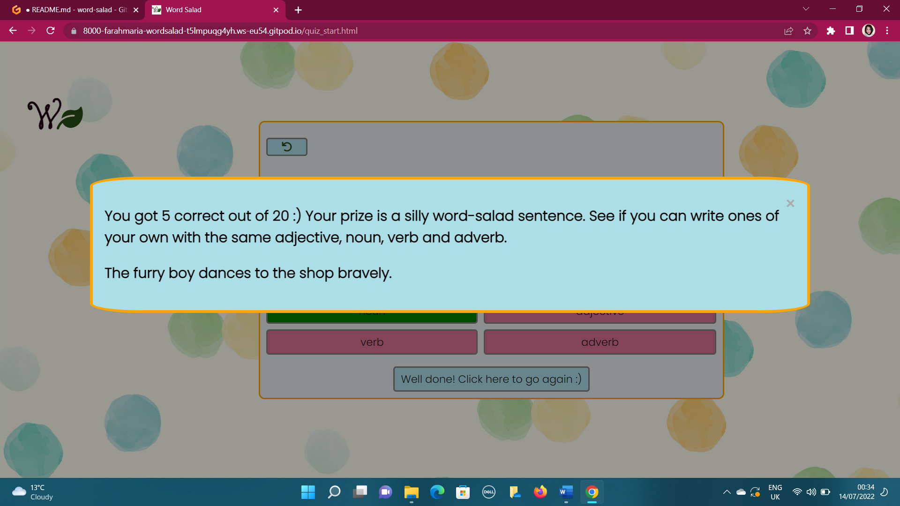

      

The user is given their score out of 20, and regardless of their actual score there is a congratulatory tone on completing the quiz. A word-salad silly sentence is generated and returned to the user, and they are asked to write some silly sentences of their own using the same noun, adjective, verb and adverb.  

The colours for the modal text-box are brighter than any other element on the pages so far, and the text is bold.

-_'Well Done! Click Here to Go Again' button_-

As shown above, the arrow button at the bottom of the quiz container is transformed into a 'well done' button when the quiz has been completed, and pressing the button restarts the quiz. The user is congratulated, regardless of their score, and encouraged to practice more. This is in keeping with educational approaches for children rather than competitive games for leisure.

With extra time, I would certainly style this button to be a new colour! There is a smiley face on it, but it's easy to miss because it's the same colour and style as previous buttons.

## **Testing**

To test for design responsivity, I used the dev tools on Google Chrome to check for different screen sizes, starting with the dimensions on the iphone4. The iphone 4 is the smallest screen size catered for, and I am happy with this, as a young person should not be completing an educational quiz on a very tiny screen. 

I followed the advice outlined in my 'Sam's Teach Yourself' textbook that I have on CSS and HTML. "Focus your breakpoints on where your design starts to fail rather than worrying about specific devices or widths. It's also a good idea to strive for as few breakpoints as your design can handle and not be broken" (p.468, Colburn, Kyrnin & Lemay 2016). Rather than creating a media query for the dimensions of lots of devices, I just took my design and used the dev tools in Chrome to extend or reduce the size and took note of the points at which (measured in pixels) the page lost its integrity. Then I made my media queries based on this, but definitely starting with the precise dimensions of an iphone4. 

To test for accessibility, I used the Lighthouse report generator in Chrome dev tools to check that the accessibility scores for the desktop and mobile versions of the site were over 70%, which they are. As shown by the screenshot below, the desktop version of the game scored extremely well on accessibility, performance and best practices.

 

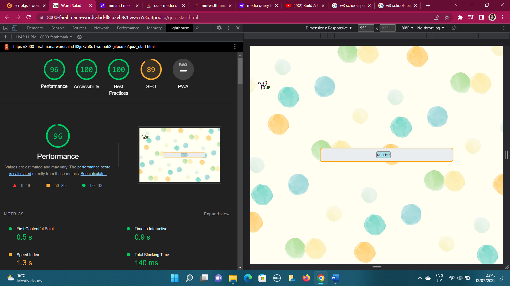

   

The mobile version did not do as well in the Lighthouse report, but still scored cleanly over 70% each time I ran the report. 

 

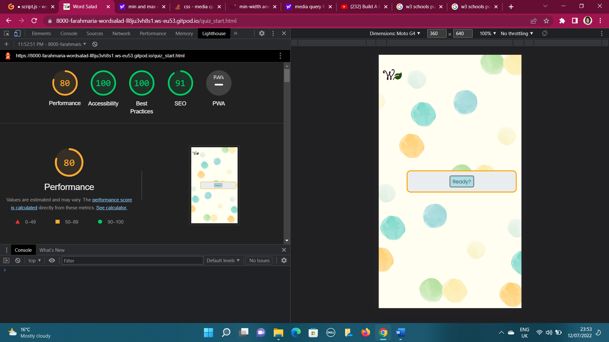

   

I noticed that the report results were  different when I ran them again, and I wasn't sure if the quality of my internet connection was causing this. When I ran the report again, I got a lower score, but it was still above 70% each time. The score for accessibility and best practices were still very high indeed for the mobile version.

I taught myself how to use breakpoints in the Chrome dev tools, so I used these instead of console logs to check my JavaScript functions.

I also used to dev tools window to see where there was an 'x' in red, and went to that part of the code to correct it. It turned out my syntax needed correcting in a few places.

 ## **Code Validation (and bugs!)**

 Both pages of my HTML eventually passed when I copied and pasted the code into the free w3 validator service online. The screenshots are below.  

 

   

 

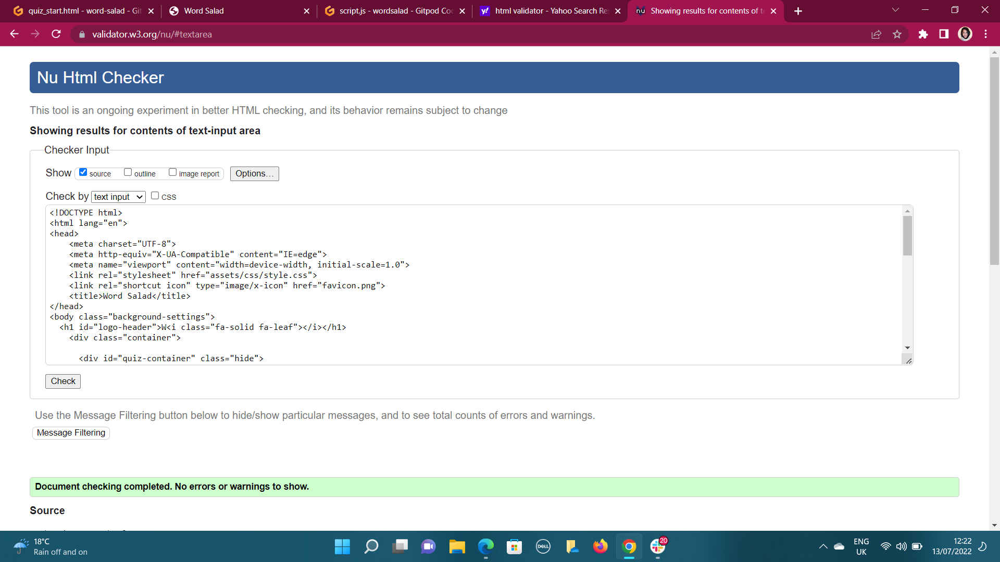

 

When I first tested the code, there were a few paragraph ending tags (
) where no paragraphs had been opened, so I replaced these with breaks ( ).

Also, I had created two buttons by placing anchor tags inside <button> tags, and the validator reminded me that this is not acceptable! I recalled that hyperlinks can still be styled as buttons with hover effects, etc, and was able to correct this and get my code to pass quite swiftly.

The CSS code for the site also passed when it was cut and paste into the Jigsaw w3 validation service online. The screenshot showing this is below.

 

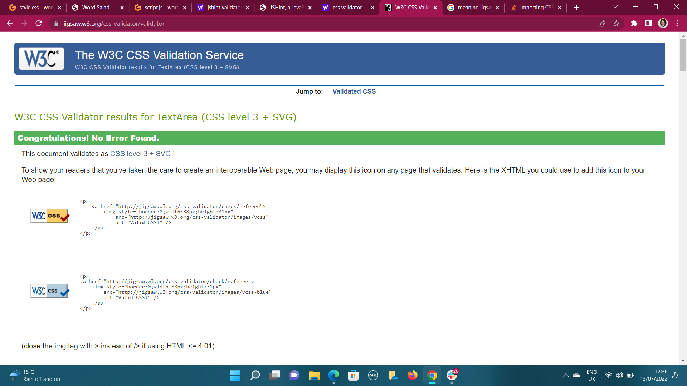

 

Before it passed, however, I was reminded that a font-weight should not be a percentage, so I changed this and the code passed immediately.

Using JShint for the first time to look at my Javascript code was a very different experience, as it doesn't offer a 'pass', but more detailed feedback. The main issues were missing semi-colons, which was an easy issue to remedy, and I was informed by the process that a number should start with . such as .5, but should rather be 0.5, so that it isn't mistaken as a dot instead of a decimal point. (See suggestion for line 29 below). 

 

 

I changed this, of course. The other remaining comments about ES6 code... well, I wasn't sure what to do about them, as the deadline was looming and my understanding from the course material on the LMS itself is that declaring a variable as 'const' is very much allowed on the course. I felt relatively confident enough about this, and that my arrow functions would surely get me a higher mark rather than a lower one. 

## **Deployment**

I used GitHub pages to deploy my site. The process was very simple. Go to the repo for 'Word-Salad' at https://github.com/farah-maria/word-salad (make sure it's hyphenated, as there is another version) and clone it. Here are notes from GitHub on how to clone a repository: https://docs.github.com/en/repositories/creating-and-managing-repositories/cloning-a-repository.

To deploy, I clicked on 'settings' after going into the repository and scrolled down. The menu down the lefthand side has an option called 'pages'. I clicked on this, and after a few moments the site was deployed and GitHub automatically showed the web address in blue. This is the address for the live site, which anyone can now access from their own devices. (The one for this quiz is: https://farah-maria.github.io/word-salad/).

## **Documentation & Gitpod/Hub BUGS!!!**

Besides this Read.md document, I regularly committed my changes using Git Pod/ Git Hub for version control. But after doing a hard reset in GitPod (git reset --hard 123456), a merge conflict occured and I am not sure how or why. I learned more about GitHub and the branches and head, and with some help on Slack managed to Git pull and choose which changes I wanted to go to the 'head' in various files in by clicking on them. I taught myself this, which might be helpful in future, but it was very worrysome. As this occured late at night, I cut and paste my code into a second, new repo to do a little bit more work on it. Thankfully, the project, in terms of coding, was already close to completion. When I solved the issue the next day, I moved the very minor changes back across and committed comments about this issue (as well as a poor internet connection, possibly).

## Notes on extra aspects of JavaScript Coding that I learned and Tutorials I used**

I learned about arrow functions and used these for more concise code.

I started naming things with three letters such as 'str' or 'num' at the start to specificy whether it's a string, number etc. My mentor informed me, however, that this won't be necessary in future as I'll be using wrap-arounds for the JavaScript

For the quiz, I watched Web Dev Simplified on YouTube, who has a video called 'Build A quiz with JavaScript' which can be found at: https://www.youtube.com/watch?v=riDzcEQbX6k.

The idea for the word-salad sentences was built around a word-blank activity using JavaScript on YouTube, which can be found at: https://www.youtube.com/watch?v=PkGfIHuSRx0. I coded this into functions that would output to the HTML, and taught myself how to made a modal text box from W3 Schools (lesson at: How To - JS/CSS Modal https://www.w3schools.com/howto/howto_css_modals.asp).

## **Acknowledgements**

1. Am I Responsive? (https://amiresponsive.co.uk/) This free site illustrates how your web project looks on different devices in an attractive way.

2. Google Fonts. (https://fonts.google.com/) 

3. Font Awesome. (https://fontawesome.com/)

5. Background image by rawpixel.com, downloaded from freepik.com.  https://www.freepik.com/free-vector/colorful-geometric-seamless-pattern-background-design_13311484.htm#query=kids%20background&position=0&from_view=keyword

6. Code for basic quiz inspired by Web Dev Simplied on YouTube: https://www.youtube.com/watch?v=riDzcEQbX6k 

7. Idea for word-salad sentence inspired by word-blanks challenge from Free Code Camp's Word Blank Challenge: https://www.youtube.com/watch?v=PkGfIHuSRx0

8. W3 schools "HOW TO - JS/CSS Modal" at https://www.w3schools.com/howto/howto_css_modals.asp

11. Chrome developer tools, including Lighthouse. https://developer.chrome.com/docs/lighthouse/overview/

12. W3C Markup Validation Service (https://validator.w3.org/index.html)

13. W3C Jigsaw CSS Validation Service (https://jigsaw.w3.org/css-validator/)

14. Colborn, R. Kyrnin, J. & Lemay, L. (2016) Sam's Teach Yourself HTML, CSS & JavaScript: Web Publishing in One Hour a Day. Pearson Education, Indiana.

15. JShint - JavaScript Quality Tool: https://jshint.com/